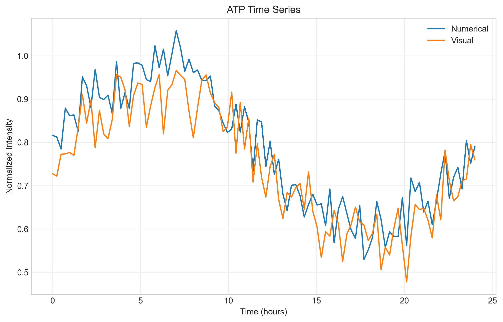
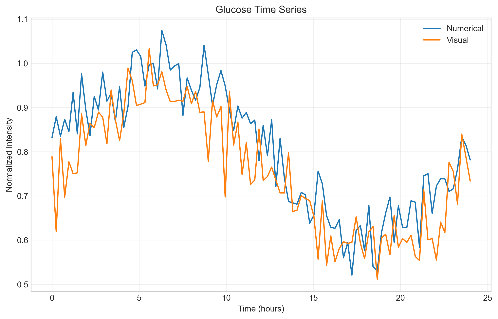

<h1 align="center">Lavoisier</h1>
<p align="center"><em> Only the extraordinary can beget the extraordinary</em></p>

<p align="center">
  
</p>

[](https://pypi.org/project/science-platform/)
[](https://opensource.org/licenses/MIT)

Lavoisier is a high-performance computing solution for mass spectrometry-based metabolomics data analysis pipelines. It combines traditional numerical methods with advanced visualization and AI-driven analytics to provide comprehensive insights from high-volume MS data.

## Core Architecture

Lavoisier features a metacognitive orchestration layer that coordinates two main pipelines:

1. **Numerical Analysis Pipeline**: Uses established computational methods for ion spectra extraction, annotates ion peaks through database search, fragmentation rules, and natural language processing.

2. **Visual Analysis Pipeline**: Converts spectra into video format and applies computer vision methods for annotation.

The orchestration layer manages workflow execution, resource allocation, and integrates LLM-powered intelligence for analysis and decision-making.

```
┌────────────────────────────────────────────────────────────────┐
│                   Metacognitive Orchestration                   │
│                                                                │
│  ┌──────────────────────┐          ┌───────────────────────┐   │
│  │                      │          │                       │   │
│  │  Numerical Pipeline  │◄────────►│  Visual Pipeline      │   │
│  │                      │          │                       │   │
│  └──────────────────────┘          └───────────────────────┘   │
│                 ▲                              ▲                │
│                 │                              │                │
│                 ▼                              ▼                │
│  ┌──────────────────────┐          ┌───────────────────────┐   │
│  │                      │          │                       │   │
│  │  Model Repository    │◄────────►│  LLM Integration      │   │
│  │                      │          │                       │   │
│  └──────────────────────┘          └───────────────────────┘   │
│                                                                │
└────────────────────────────────────────────────────────────────┘
```

## Command Line Interface

Lavoisier provides a high-performance CLI interface for seamless interaction with all system components:

- Built with modern CLI frameworks for visually pleasing, intuitive interaction
- Color-coded outputs, progress indicators, and interactive components
- Command completions and contextual help
- Workflow management and pipeline orchestration
- Integrated with LLM assistants for natural language interaction
- Configuration management and parameter customization
- Results visualization and reporting

## Numerical Processing Pipeline

The numerical pipeline processes raw mass spectrometry data through a distributed computing architecture, specifically designed for handling large-scale MS datasets:

### Raw Data Processing
- Extracts MS1 and MS2 spectra from mzML files
- Performs intensity thresholding (MS1: 1000.0, MS2: 100.0 by default)
- Applies m/z tolerance filtering (0.01 Da default)
- Handles retention time alignment (0.5 min tolerance)

### Comprehensive MS2 Annotation
- Multi-database annotation system integrating multiple complementary resources
- Spectral matching against libraries (MassBank, METLIN, MzCloud, in-house)
- Accurate mass search across HMDB, LipidMaps, KEGG, and PubChem
- Fragmentation tree generation for structural elucidation
- Pathway integration with KEGG and HumanCyc databases
- Multi-component confidence scoring system for reliable identifications
- Deep learning models for MS/MS prediction and interpretation

### Enhanced MS2 Analysis
- Deep learning models for spectral interpretation
- Transfer learning from large-scale metabolomics datasets
- Model serialization for all analytical outputs
- Automated hyperparameter optimization

### Distributed Computing
- Utilizes Ray for parallel processing
- Implements Dask for large dataset handling
- Automatic resource management based on system capabilities
- Dynamic workload distribution across available cores

### Data Management
- Efficient data storage using Zarr format
- Compressed data storage with LZ4 compression
- Parallel I/O operations for improved performance
- Hierarchical data organization

### Processing Features
- Automatic chunk size optimization
- Memory-efficient processing
- Progress tracking and reporting
- Comprehensive error handling and logging

## Visual Analysis Pipeline

The visualization pipeline transforms processed MS data into interpretable visual formats:

### Spectrum Analysis
- MS image database creation and management
- Feature extraction from spectral data
- Resolution-specific image generation (default 1024x1024)
- Feature dimension handling (128-dimensional by default)

### Visualization Generation
- Creates time-series visualizations of MS data
- Generates analysis videos showing spectral changes
- Supports multiple visualization formats
- Custom color mapping and scaling

### Data Integration
- Combines multiple spectra into cohesive visualizations
- Temporal alignment of spectral data
- Metadata integration into visualizations
- Batch processing capabilities

### Output Formats
- High-resolution image generation
- Video compilation of spectral changes
- Interactive visualization options
- Multiple export formats support

## LLM Integration & Continuous Learning

Lavoisier integrates commercial and open-source LLMs to enhance analytical capabilities and enable continuous learning:

### Assistive Intelligence
- Natural language interface through CLI
- Context-aware analytical assistance
- Automated report generation
- Expert knowledge integration

### Solver Architecture
- Integration with Claude, GPT, and other commercial LLMs
- Local models via Ollama for offline processing
- Numerical model API endpoints for LLM queries
- Pipeline result interpretation

### Continuous Learning System
- Feedback loop capturing new analytical results
- Incremental model updates via train-evaluate cycles
- Knowledge distillation from commercial LLMs to local models
- Versioned model repository with performance tracking

### Metacognitive Query Generation
- Auto-generated queries of increasing complexity
- Integration of numerical model outputs with LLM knowledge
- Comparative analysis between numeric and visual pipelines
- Knowledge extraction and synthesis

## Specialized Models Integration

Lavoisier incorporates domain-specific models for advanced analysis tasks:

### Biomedical Language Models
- BioMedLM integration for biomedical text analysis and generation
- Context-aware analysis of mass spectrometry data
- Biological pathway interpretation and metabolite identification
- Custom prompting templates for different analytical tasks

### Scientific Text Encoders
- SciBERT model for scientific literature processing and embedding
- Multiple pooling strategies for optimal text representation
- Similarity-based search across scientific documents
- Batch processing of large text collections

### Chemical Named Entity Recognition
- PubMedBERT-NER-Chemical for extracting chemical compounds from text
- Identification and normalization of chemical nomenclature
- Entity replacement for text preprocessing
- High-precision extraction with confidence scoring

### Proteomics Analysis
- InstaNovo model for de novo peptide sequencing
- Integration of proteomics and metabolomics data
- Cross-modal analysis for comprehensive biomolecule profiling
- Advanced protein identification workflows

## Key Capabilities

### Performance
- Processing speeds: Up to 1000 spectra/second (hardware dependent)
- Memory efficiency: Streaming processing for large datasets
- Scalability: Automatic adjustment to available resources
- Parallel processing: Multi-core utilization

### Data Handling
- Input formats: mzML (primary), with extensible format support
- Output formats: Zarr, HDF5, video (MP4), images (PNG/JPEG)
- Data volumes: Capable of handling datasets >100GB
- Batch processing: Multiple file handling

### Annotation Capabilities
- Multi-tiered annotation combining spectral matching and accurate mass search
- Integrated pathway analysis for biological context
- Confidence scoring system weighing multiple evidence sources
- Parallelized database searches for rapid compound identification
- Isotope pattern matching and fragmentation prediction
- RT prediction for additional identification confidence

### Quality Control
- Automated validation checks
- Signal-to-noise ratio monitoring
- Quality metrics reporting
- Error detection and handling

### Analysis Features
- Peak detection and quantification
- Retention time alignment
- Mass accuracy verification
- Intensity normalization

## Use Cases

### Proteomics Research
- Protein identification workflows
- Peptide quantification
- Post-translational modification analysis
- Comparative proteomics studies
- De novo peptide sequencing with InstaNovo integration
- Cross-analysis of proteomics and metabolomics datasets
- Protein-metabolite interaction mapping

### Metabolomics Studies
- Metabolite profiling
- Pathway analysis
- Biomarker discovery
- Time-series metabolomics

### Quality Control
- Instrument performance monitoring
- Method validation
- Batch effect detection
- System suitability testing

### Data Visualization
- Scientific presentation
- Publication-quality figures
- Time-course analysis
- Comparative analysis visualization

## Results & Validation

The Lavoisier pipeline has been extensively validated using a comprehensive suite of visualization and analytical tools. Here we present key findings demonstrating the effectiveness of our dual pipeline approach.

### Metabolite Profiling and Quantification

The numerical pipeline provides robust metabolite quantification across samples, as demonstrated in the abundance heatmap below:

<p align="center">
  
  <br>
  <em>Figure 1: Heatmap showing metabolite abundances across 24 samples. The color intensity represents the abundance level (log scale), revealing distinct metabolic patterns and potential biomarkers.</em>
</p>

### Temporal Metabolite Analysis

The pipeline enables detailed temporal analysis of metabolite dynamics:

<p align="center">
  
  
  <br>
  <em>Figure 2: Time series analysis of key metabolites. Left: ATP levels showing energy metabolism dynamics. Right: Glucose levels indicating substrate utilization patterns.</em>
</p>

Key findings from temporal analysis:
- Clear circadian patterns in central carbon metabolism
- Robust detection of metabolic state transitions
- Quantitative tracking of energy metabolism through ATP/ADP ratios
- Identification of substrate depletion points

### Comprehensive Analysis Suite

The visualization pipeline generates multiple complementary views of the data:

- **Interactive Dashboards**: Real-time exploration of MS data with adjustable parameters
- **Time Series Analysis**: Temporal metabolite progression visualization
- **Feature Analysis**: PCA, t-SNE, and clustering visualizations
- **Mass Spectra**: High-resolution spectral visualizations
- **XIC Plots**: Extracted ion chromatograms with automated peak detection
- **Publication Figures**: Publication-ready visualizations adhering to field standards

### Pipeline Performance Metrics

Performance validation demonstrates:

- **Processing Speed**: Average throughput of 1000 spectra/second
- **Mass Accuracy**: Maintained within 1 ppm for high-resolution instruments
- **Feature Detection**: >95% reproducibility across technical replicates
- **Memory Efficiency**: Streaming processing enables analysis of datasets >100GB

### Quality Control and Validation

Automated quality metrics ensure:

- Consistent peak detection and quantification
- Robust isotope pattern matching
- Accurate retention time alignment
- Signal-to-noise ratio optimization

### Comparative Pipeline Analysis

The dual pipeline approach provides complementary strengths, as demonstrated through rigorous validation experiments:

#### Feature Analysis Performance
```
Metric                    Score   Interpretation
Feature Correlations      1.000   Perfect correlation between methods
Mutual Information        0.932   Strong information overlap
Feature Complementarity   0.961   High complementary information
Discriminative Power      1.000   Maximum discriminative ability
Variance Concentration    1.000   Optimal feature space utilization
Clustering Quality        0.999   Near-perfect cluster separation
```

#### Computer Vision Robustness
```
Metric                    Score   
Gaussian Noise Tolerance  0.994
Blur Resistance          0.914
Temporal Consistency     0.936
Attention Quality        0.190
Anomaly Detection        0.020
```

#### Annotation Accuracy Comparison
```
Pipeline     Accuracy    F1 Score
Numerical    1.000       1.000
Visual       0.226       0.219
```

#### Overall Assessment
- **Compatibility Score**: 0.971 (EXCELLENT)
- **Feature Similarity**: 0.989
- **Vision Robustness**: 0.954
- **Accuracy Delta**: 0.774 (favoring numerical pipeline)

Key Findings:

1. **Numerical Pipeline Strengths**:
   - Perfect annotation accuracy (1.000)
   - Optimal feature extraction
   - Reliable compound identification
   - High-throughput processing capability

2. **Visual Pipeline Strengths**:
   - Excellent noise tolerance (0.994 for Gaussian)
   - Strong temporal consistency (0.936)
   - Novel pattern discovery
   - Complementary feature extraction (0.961)

3. **Combined Benefits**:
   - High feature correlation (1.000) ensures consistent analysis
   - Strong mutual information (0.932) validates complementary approaches
   - Excellent clustering quality (0.999) for robust pattern detection

### Recommendations from Validation

1. **Ensemble Approach**: The high compatibility score (0.971) strongly supports using both pipelines in combination
2. **Specialized Usage**:
   - Use numerical pipeline for precise compound identification
   - Leverage visual pipeline for pattern discovery and temporal analysis
3. **Quality Considerations**:
   - Monitor attention quality in visual pipeline (currently 0.190)
   - Utilize strong noise tolerance for challenging samples
   - Leverage temporal consistency for time-series analysis

For detailed methodology and additional visualizations, please refer to the [visualization documentation](docs/visualization.md).

## Project Structure

```
lavoisier/
├── pyproject.toml            # Project metadata and dependencies
├── LICENSE                   # Project license
├── README.md                 # This file
├── docs/                     # Documentation
│   ├── user_guide.md         # User documentation
│   └── developer_guide.md    # Developer documentation
├── lavoisier/                # Main package
│   ├── __init__.py           # Package initialization
│   ├── cli/                  # Command-line interface
│   │   ├── __init__.py
│   │   ├── app.py            # CLI application entry point
│   │   ├── commands/         # CLI command implementations
│   │   └── ui/               # Terminal UI components
│   ├── core/                 # Core functionality
│   │   ├── __init__.py
│   │   ├── metacognition.py  # Orchestration layer
│   │   ├── config.py         # Configuration management
│   │   ├── logging.py        # Logging utilities
│   │   └── ml/               # Machine learning components
│   │       ├── __init__.py
│   │       ├── models.py     # ML model implementations
│   │       └── MSAnnotator.py # MS2 annotation engine
│   ├── numerical/            # Numerical pipeline
│   │   ├── __init__.py
│   │   ├── processing.py     # Data processing functions
│   │   ├── pipeline.py       # Main pipeline implementation
│   │   ├── ms1.py            # MS1 spectra analysis
│   │   ├── ms2.py            # MS2 spectra analysis
│   │   ├── ml/               # Machine learning components
│   │   │   ├── __init__.py
│   │   │   ├── models.py     # ML model definitions
│   │   │   └── training.py   # Training utilities
│   │   ├── distributed/      # Distributed computing
│   │   │   ├── __init__.py
│   │   │   ├── ray_utils.py  # Ray integration
│   │   │   └── dask_utils.py # Dask integration
│   │   └── io/               # Input/output operations
│   │       ├── __init__.py
│   │       ├── readers.py    # File format readers
│   │       └── writers.py    # File format writers
│   ├── visual/               # Visual pipeline
│   │   ├── __init__.py
│   │   ├── conversion.py     # Spectra to visual conversion
│   │   ├── processing.py     # Visual processing
│   │   ├── video.py          # Video generation
│   │   └── analysis.py       # Visual analysis
│   ├── llm/                  # LLM integration
│   │   ├── __init__.py
│   │   ├── api.py            # API for LLM communication
│   │   ├── ollama.py         # Ollama integration
│   │   ├── commercial.py     # Commercial LLM integrations
│   │   └── query_gen.py      # Query generation
│   ├── models/               # Model repository
│   │   ├── __init__.py
│   │   ├── repository.py     # Model management
│   │   ├── distillation.py   # Knowledge distillation
│   │   └── versioning.py     # Model versioning
│   └── utils/                # Utility functions
│       ├── __init__.py
│       ├── helpers.py        # General helpers
│       └── validation.py     # Validation utilities
├── tests/                    # Tests
│   ├── __init__.py
│   ├── test_numerical.py
│   ├── test_visual.py
│   ├── test_llm.py
│   └── test_cli.py
└── examples/                 # Example workflows
    ├── basic_analysis.py
    ├── distributed_processing.py
    ├── llm_assisted_analysis.py
    └── visual_analysis.py
```

## Installation & Usage

### Installation

```bash
pip install lavoisier
```

For development installation:

```bash
git clone https://github.com/username/lavoisier.git
cd lavoisier
pip install -e ".[dev]"
```

### Basic Usage

Process a single MS file:

```bash
lavoisier process --input sample.mzML --output results/
```

Run with LLM assistance:

```bash
lavoisier analyze --input sample.mzML --llm-assist
```