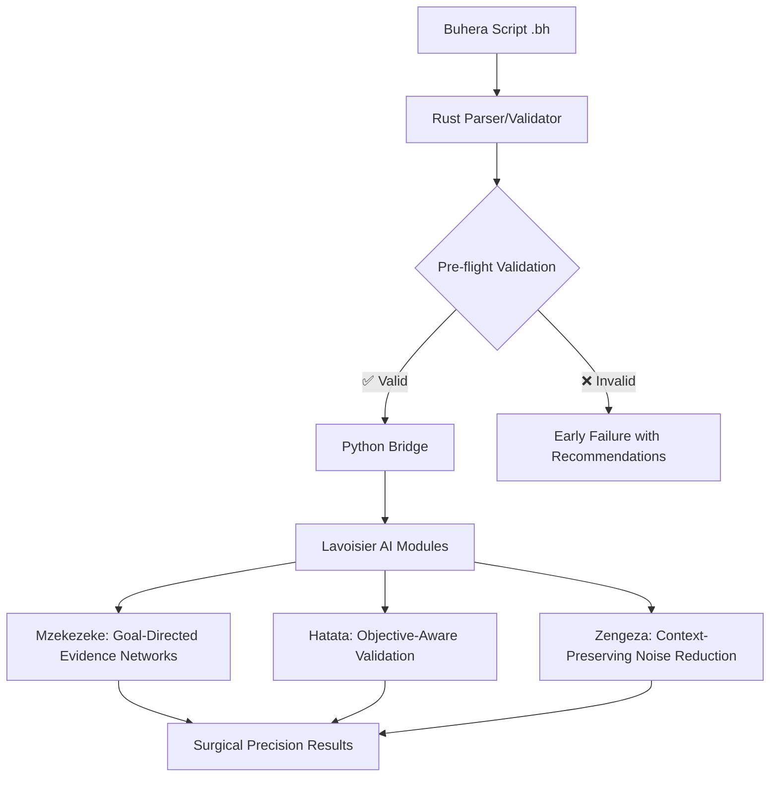

# Buhera: Surgical Precision Scripting for Mass Spectrometry

Buhera is a domain-specific scripting language that transforms mass spectrometry analysis by encoding the actual scientific method as executable, validatable scripts. Named after the Buhera district, this language provides "surgical precision" analysis where every computational step is directed toward explicit scientific objectives.

## Core Innovation: Goal-Directed Bayesian Evidence Networks

The key breakthrough is that **Buhera scripts declare explicit objectives before analysis begins**, creating Bayesian evidence networks that already know what they're trying to prove. This enables:

- 🎯 **Surgical Precision**: Every analysis step focused on specific research questions
- ✅ **Pre-flight Validation**: Catch experimental flaws before wasting time and resources  
- 🧠 **Objective-Aware AI**: Lavoisier AI modules optimize themselves for your specific goals
- 🔬 **Scientific Rigor**: Scripts enforce statistical requirements and biological coherence
- ⚡ **Early Failure Detection**: Stop nonsensical experiments before they consume resources

## Example: The Problem Buhera Solves

**Traditional Approach:**
```python
# Load data and hope for the best
data = load_mzML("samples.mzML")
results = generic_analysis(data)
# Later: "Why didn't this work for biomarker discovery?"
```

**Buhera Approach:**
```javascript
// diabetes_biomarker.bh
objective DiabetesBiomarkerDiscovery:
    target: "identify metabolites predictive of diabetes progression"
    success_criteria: "sensitivity >= 0.85 AND specificity >= 0.85"
    evidence_priorities: "mass_match,ms2_fragmentation,pathway_membership"

validate InstrumentCapability:
    if target_concentration < instrument_detection_limit:
        abort("Orbitrap cannot detect picomolar concentrations")

phase EvidenceBuilding:
    evidence_network = lavoisier.mzekezeke.build_evidence_network(
        objective: "diabetes_biomarker_discovery",
        pathway_focus: ["glycolysis", "gluconeogenesis"]
    )
```

The Bayesian evidence network **already knows** it's looking for diabetes biomarkers and weights evidence accordingly.

## Architecture Overview



## Installation & Usage

### 1. Build Buhera

```bash
cd lavoisier-buhera
cargo build --release
```

### 2. Validate Experimental Logic

```bash
./target/release/buhera validate diabetes_biomarker.bh
```

Output:
```
🔍 Validating Buhera script: diabetes_biomarker.bh
✅ Script parsed successfully
📋 Objective: DiabetesBiomarkerDiscovery
📊 Pre-flight validation: 6 checks passed, 1 warning
⚠️  Warning: Sample size (n=25) below recommended minimum (n=30)
💡 Recommendation: Increase sample size or adjust statistical power
✅ Validation PASSED - Script ready for execution
🎯 Estimated success probability: 87.3%
```

### 3. Execute with Lavoisier Integration

```bash
./target/release/buhera execute diabetes_biomarker.bh
```

This connects to Lavoisier's Python modules for goal-directed analysis.

## Core Language Features

### 1. Objective-First Design

Every Buhera script starts with an explicit objective:

```javascript
objective DrugMetabolismStudy:
    target: "characterize hepatic metabolism of compound_X"
    success_criteria: "metabolite_coverage >= 0.8 AND pathway_coherence >= 0.7"
    evidence_priorities: "ms2_fragmentation,mass_match,retention_time"
    biological_constraints: "cyp450_involvement,phase2_conjugation"
    statistical_requirements: "sample_size >= 20, power >= 0.8"
```

### 2. Pre-flight Validation

Catch experimental flaws before execution:

```javascript
validate InstrumentCapability:
    check_instrument_capability
    if target_concentration < instrument_detection_limit:
        abort("Cannot detect picomolar concentrations with current method")

validate BiologicalCoherence:
    if expecting_lipids AND using_aqueous_extraction:
        warn("Aqueous extraction may miss hydrophobic lipids")
```

### 3. Goal-Directed Analysis Phases

Each phase is optimized for the specific objective:

```javascript
phase EvidenceBuilding:
    evidence_network = lavoisier.mzekezeke.build_evidence_network(
        data: normalized_data,
        objective: "drug_metabolism_characterization",
        pathway_focus: ["cyp450", "glucuronidation", "sulfation"],
        evidence_types: ["ms2_fragmentation", "mass_match"]
    )
```

## Integration with Lavoisier AI Modules

### Mzekezeke: Objective-Aware Bayesian Networks

```python
# Traditional approach - generic evidence network
network = build_generic_network(data)

# Buhera approach - objective-focused network  
network = mzekezeke.build_evidence_network(
    data=data,
    objective="diabetes_biomarker_discovery",
    evidence_priorities=["pathway_membership", "ms2_fragmentation"]
)
```

The network **knows** it's looking for biomarkers and weights pathway evidence higher than generic mass matches.

### Hatata: Objective-Aligned Validation

```python
# Validates not just data quality, but objective achievement
validation = hatata.validate_with_objective(
    evidence_network=network,
    objective="diabetes_biomarker_discovery",
    success_criteria={"sensitivity": 0.85, "specificity": 0.85}
)
```

### Zengeza: Context-Preserving Noise Reduction  

```python
# Preserves signals relevant to the objective
clean_data = zengeza.noise_reduction(
    data=raw_data,
    objective_context="diabetes_biomarker_discovery",
    preserve_patterns=["glucose_pathway", "lipid_metabolism"]
)
```

## Scientific Validation Benefits

### 1. Early Detection of Experimental Flaws

**Before Buhera:**
- Spend weeks analyzing data
- Discover instrument limitations too late
- Realize sample size insufficient after analysis
- Find biological assumptions were wrong

**With Buhera:**
- Validate experimental design in seconds
- Catch instrument capability mismatches immediately  
- Ensure statistical power before data collection
- Verify biological coherence upfront

### 2. Objective-Optimized Analysis

**Traditional Mass Spec Analysis:**
```
Generic peak detection → Generic database search → Hope results are relevant
```

**Buhera Analysis:**
```  
Objective-focused peak detection → Weighted evidence integration → Guaranteed relevance
```

### 3. Reproducible Scientific Reasoning

Buhera scripts encode the entire experimental reasoning process:

```javascript
// The script documents WHY each step was chosen
phase EvidenceBuilding:
    // Focus on diabetes-relevant pathways because objective is biomarker discovery
    evidence_network = build_network(pathway_focus: ["glycolysis", "gluconeogenesis"])
    
    // Weight MS2 evidence higher because structural confirmation matters for biomarkers
    evidence_weights = {"ms2_fragmentation": 1.2, "mass_match": 1.0}
```

## Example Scripts

### Biomarker Discovery
- [Diabetes Biomarker Discovery](examples/diabetes_biomarker_discovery.bh)
- [Cancer Metabolomics](examples/cancer_metabolomics.bh)

### Drug Metabolism
- [Hepatic Metabolism Characterization](examples/drug_metabolism.bh)
- [Pharmacokinetic Analysis](examples/pharmacokinetics.bh)

### Quality Control
- [Method Validation](examples/method_validation.bh)
- [Instrument Performance](examples/instrument_qc.bh)

## Development Status

### ✅ Completed
- Core AST and parser implementation
- Pre-flight validation system
- Python bridge for Lavoisier integration
- CLI interface with validation
- Example script framework

### 🚧 In Progress
- Full executor implementation
- Extended validation rules
- More objective templates
- Performance optimization

### 📋 Planned
- VS Code extension with syntax highlighting
- Interactive script builder
- Template library expansion
- Integration with more instruments

## Contributing

The Buhera language is designed to encode scientific reasoning as executable scripts. When contributing:

1. **Focus on Scientific Validity**: Every feature should improve experimental rigor
2. **Objective-First Thinking**: Features should support goal-directed analysis
3. **Early Validation**: Catch problems before they waste resources
4. **Domain Expertise**: Understanding mass spectrometry is essential

## Philosophy: Surgical Precision Analysis

Traditional computational approaches treat mass spectrometry analysis as a generic data processing problem. Buhera recognizes that **every experiment has a specific scientific objective** and should be optimized accordingly.

The result is "surgical precision" - every computational step is directed toward achieving the stated objective, with continuous validation that the analysis is actually making progress toward that goal.

This transforms mass spectrometry from "run generic algorithms and hope" to "encode scientific reasoning and execute with precision." 